# Proxmox Desktop

[](https://github.com/Reichel-Network/proxmox-desktop/actions/workflows/ci.yml)
[](https://github.com/Reichel-Network/proxmox-desktop/actions/workflows/release.yml)

A full-featured Windows desktop client for **Proxmox VE**, built with Electron + React + TypeScript.

It talks directly to the Proxmox REST API (`/api2/json`) from Electron's main process, so it
bypasses browser CORS and transparently handles the self-signed TLS certificates that Proxmox
ships with by default.

## Screenshots

> The screenshots below use demo data to show the full UI populated.

### Dashboard
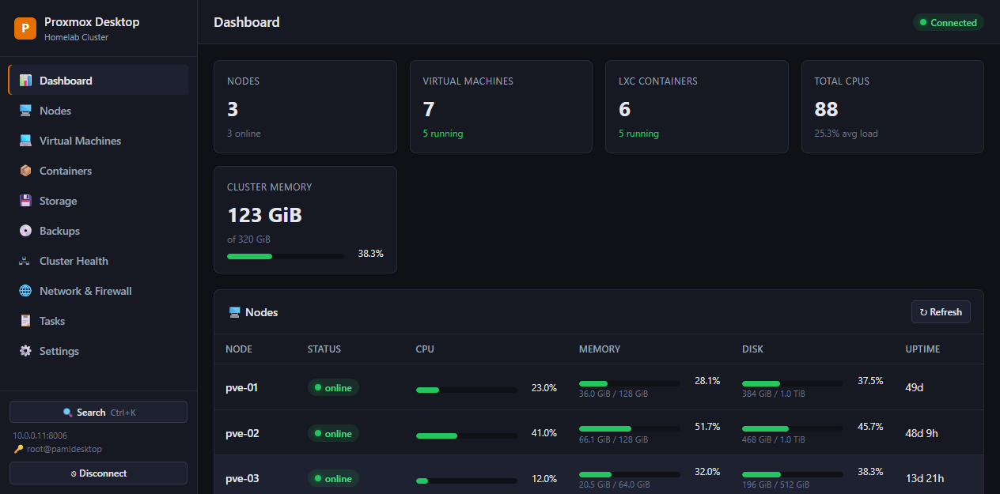

### Virtual Machines
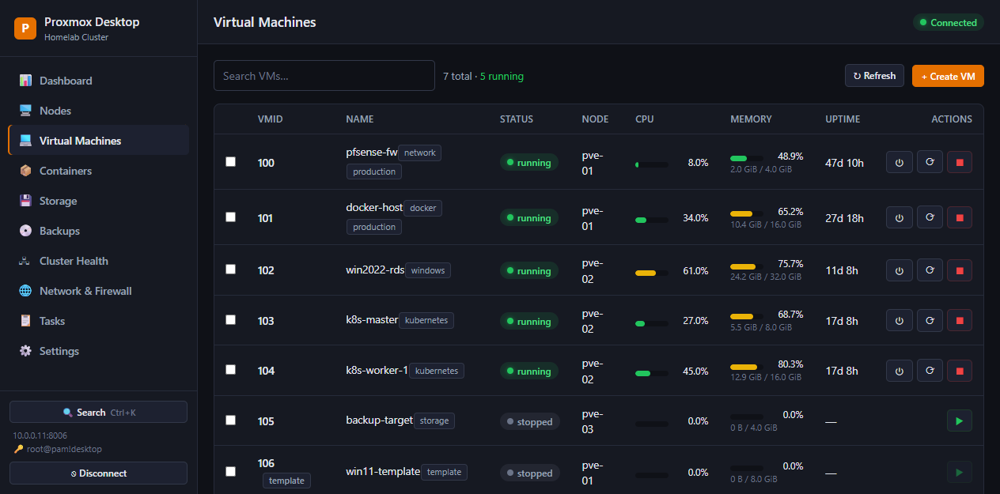

### VM detail — live resource graphs
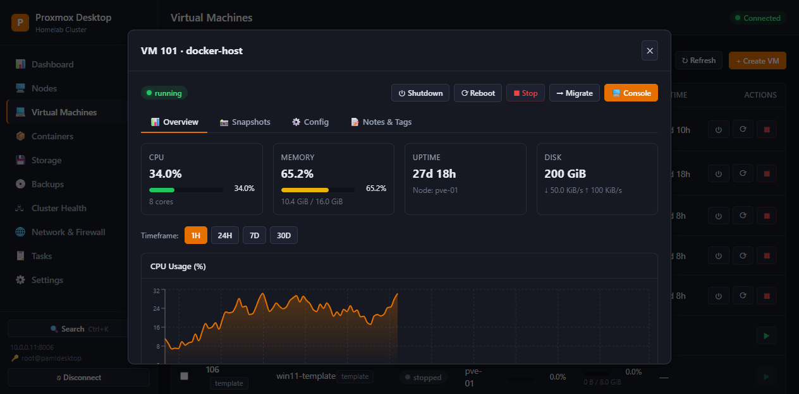

### Backups & restore
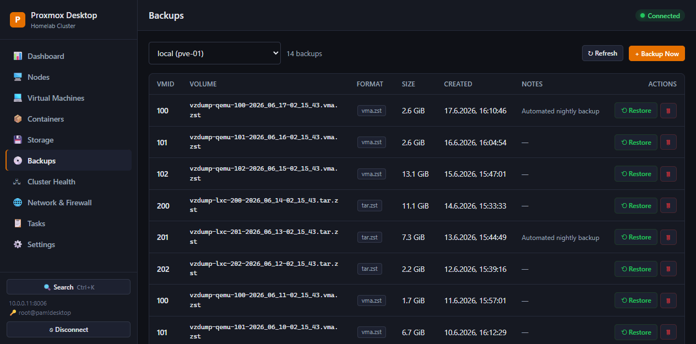

### Cluster health
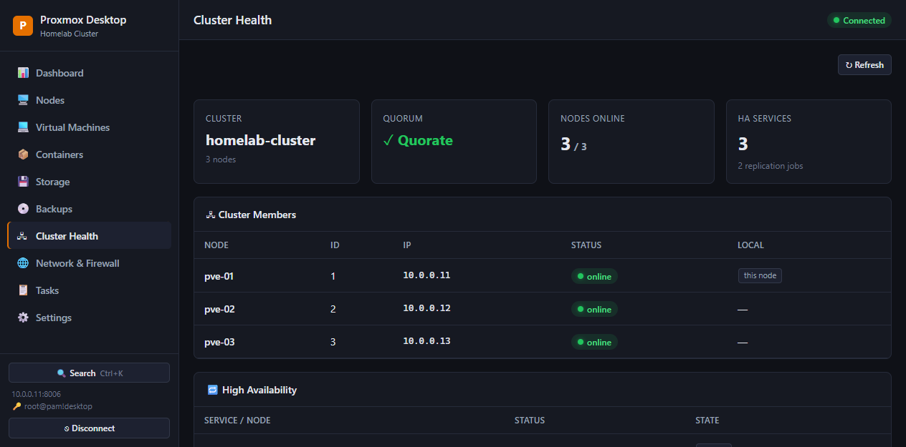

### Network & firewall
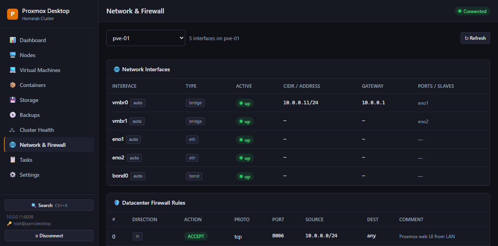

### Command palette (Ctrl+K)
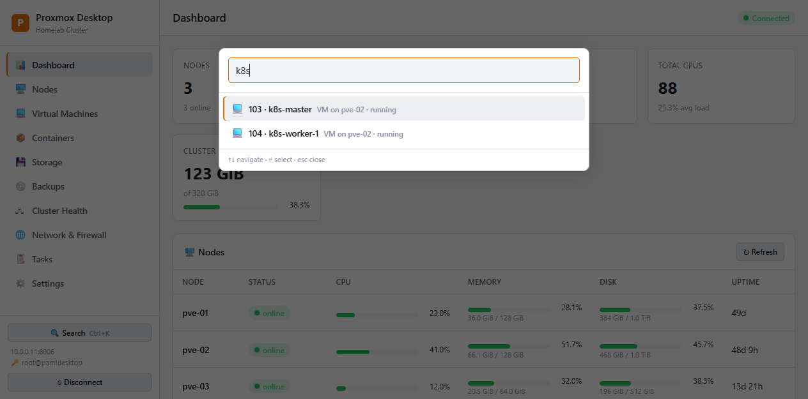

### Connection manager
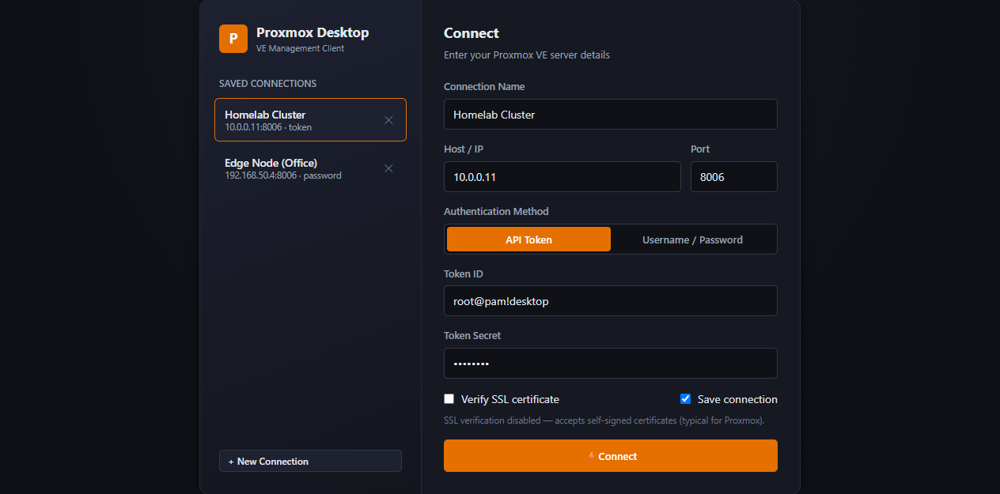

### Light theme
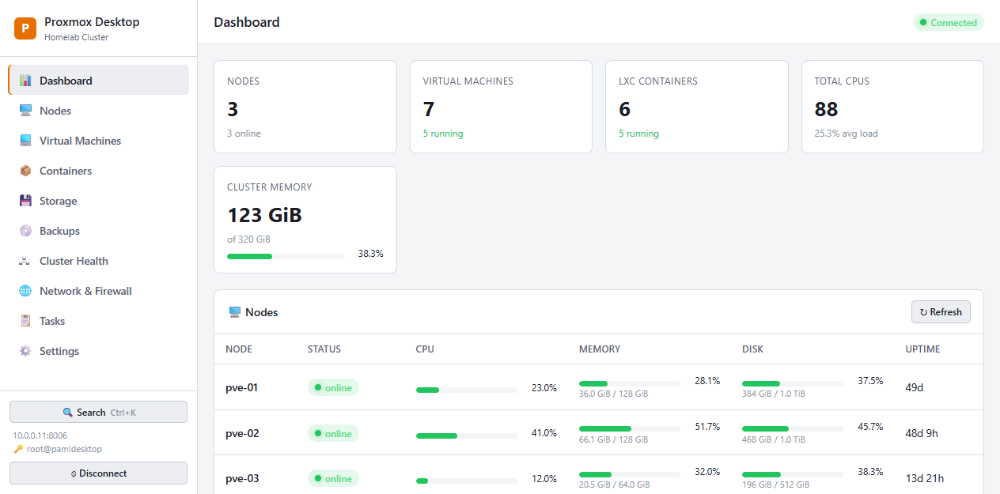

<details>
<summary>More screenshots</summary>

### LXC Containers
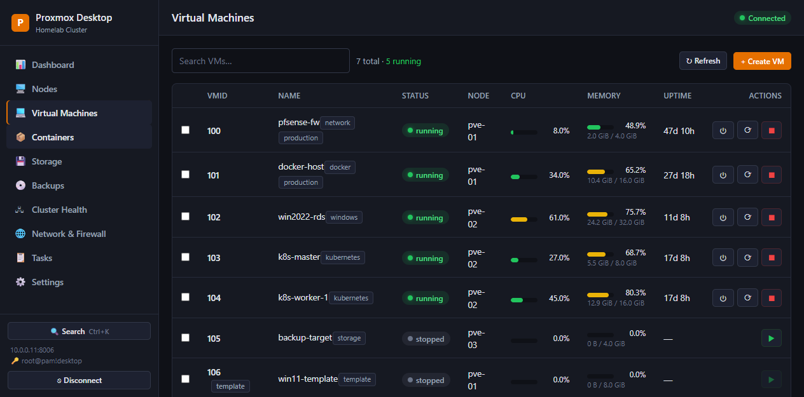

### Storage
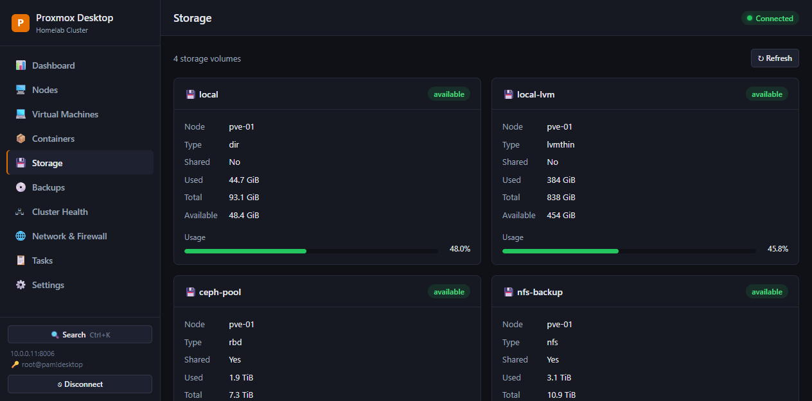

### Task log
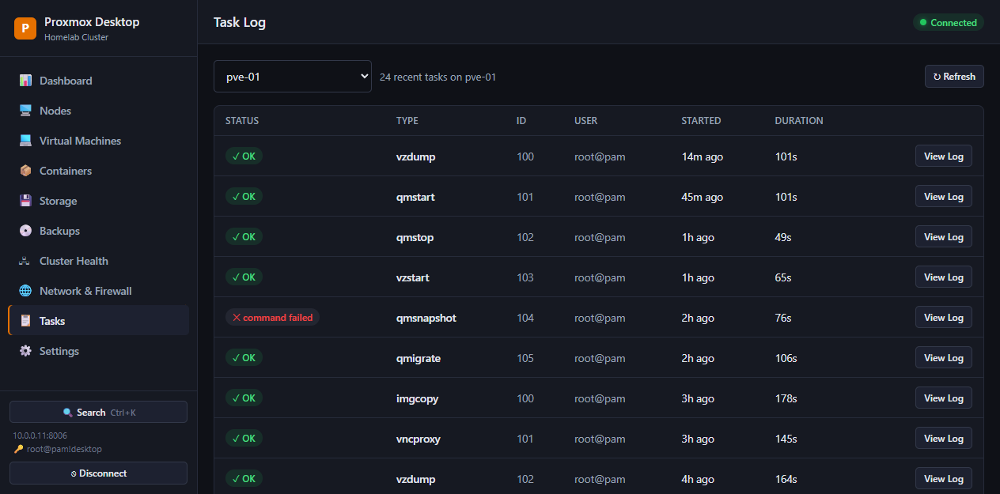

### Settings
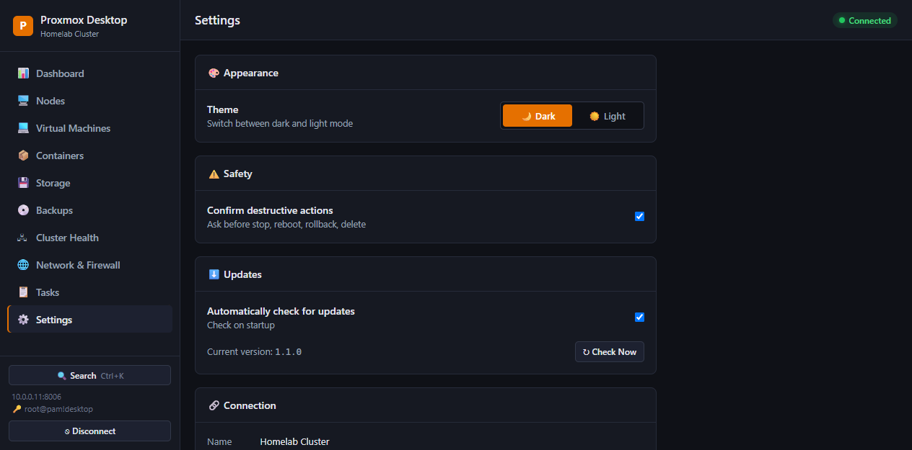

</details>

## Features

- **Multiple saved connections** — manage several Proxmox hosts/clusters; credentials stored locally.
- **Two auth methods** — API Token (`user@realm!tokenid` + secret) *or* username/password (ticket + CSRF).
- **Self-signed certs** — per-connection "Verify SSL" toggle (off by default for homelabs).
- **Dashboard** — cluster-wide stats: nodes, VMs, containers, CPU, memory, storage at a glance.
- **Nodes** — per-node CPU/mem/disk with live RRD history charts (1H / 24H / 7D / 30D).
- **Virtual Machines (QEMU)** — list, search, filter, and control.
- **LXC Containers** — same management surface as VMs.
- **Lifecycle controls** — start / shutdown / reboot / stop, with confirmation on destructive actions.
- **Guest detail** — live CPU, memory, network, and disk I/O graphs that auto-refresh.
- **noVNC console** — one click opens the VM/CT console in your browser.
- **Storage** — usage breakdown per volume across the cluster.
- **Task log** — recent tasks per node with full log viewer and live status.
- **Snapshots** — list, create, roll back, and delete VM/CT snapshots.
- **Backups & restore** — browse backups per storage, trigger `vzdump`, restore, delete.
- **VM/CT creation wizard** — guided flow to create new guests.
- **Migration** — move a guest to another node.
- **Guest config editor** — view/edit CPU, memory, disks, NICs, boot order, options.
- **Notes & tags** — edit per-guest description and manage tags.
- **Cluster health** — quorum, members, HA services, replication jobs.
- **Network & firewall** — interfaces (bridges/bonds/VLANs) and firewall rules.
- **Command palette** — `Ctrl+K` to search every VM/CT/node or jump to any page.
- **Bulk actions** — multi-select guests and start/stop/shutdown together.
- **Embedded noVNC console** — opens in-app; injects the auth cookie for password sessions.
- **Encrypted credentials** — secrets stored via Windows DPAPI (`safeStorage`), not plaintext.
- **Auto-update** — checks GitHub Releases, downloads, and installs new versions.
- **Light / dark theme** — toggle in Settings.
- **Native notifications** — alerts when a node/guest goes down or a task finishes.
- **Auto-refresh** — all views poll on sensible intervals; manual refresh everywhere.

## Requirements

- Windows 10/11, Node.js 18+ (built/tested on Node 22).
- A reachable Proxmox VE host (default API port `8006`).

## Getting Started

```bash
npm install        # install dependencies

npm run dev        # run in development (Vite dev server + Electron, with DevTools)
```

### Demo mode (no Proxmox host required)

To explore the full UI with realistic demo data — useful for screenshots or
evaluation — run the renderer with the mock backend enabled:

```bash
VITE_MOCK=1 npm run dev:renderer    # then open http://localhost:5273
```

The mock (`src/renderer/mock/mockBackend.ts`) is dev-only, gated behind the
`VITE_MOCK` flag, and never included in production builds.

## Production build & packaging

```bash
npm run build      # compile main process (tsc) + bundle renderer (vite)
npm start          # run the built app

npm run dist       # build a Windows NSIS installer (.exe) into ./release
npm run dist:dir   # build an unpacked app directory (faster, for testing)
```

The installer is produced by **electron-builder** and lands in `release/` as
`Proxmox Desktop-Setup-<version>.exe`.

## Releasing (CI/CD)

Releases are fully automated via GitHub Actions. Every push to `main` runs the
**CI** workflow (type-check + build + package smoke test). Pushing a **version tag**
runs the **Release** workflow, which builds the Windows installer and publishes a
GitHub Release with the installer, `latest.yml`, and blockmap — the artifacts the
in-app auto-updater consumes.

To cut a release:

```bash
# 1. Bump the version in package.json (e.g. 1.1.0 -> 1.2.0)
npm version 1.2.0 --no-git-tag-version

# 2. Commit and push
git add -A && git commit -m "Release v1.2.0" && git push

# 3. Tag and push the tag — this triggers the Release workflow
git tag v1.2.0 && git push origin v1.2.0
```

The GitHub Action (`.github/workflows/release.yml`) does the rest. No secrets to
configure — it uses the built-in `GITHUB_TOKEN`. You can also trigger it manually
from the Actions tab via **workflow_dispatch**.

To publish from your own machine instead of CI:

```bash
export GH_TOKEN=<your-personal-access-token>   # repo scope
npm run release
```

Once a release is published, installed copies of the app detect the new version
(Settings → Check for updates, or automatically on launch) and update themselves.

## Creating an API token in Proxmox (recommended)

1. Datacenter → Permissions → API Tokens → **Add**.
2. Pick a user (e.g. `root@pam`), give the token an ID (e.g. `desktop`).
3. **Uncheck "Privilege Separation"** for full access, or assign roles explicitly.
4. Copy the secret — it is shown only once.
5. In the app choose **API Token**, enter `root@pam!desktop` as the Token ID and paste the secret.

## Project structure

```
src/
  main/              Electron main process
    index.ts         window + IPC handlers + electron-store profiles
    ProxmoxClient.ts  HTTPS API client (TLS, token + ticket auth, RRD, tasks)
  preload/
    index.ts         contextBridge — exposes window.pmx to the renderer
  shared/
    types.ts         shared TS types
    ipc.ts           IPC channel constants
  renderer/          React UI (Vite)
    App.tsx          sidebar shell + routing
    views/           ConnectScreen, Dashboard, Nodes, Guests, Storage, Tasks, GuestDetail
    components/      Toast, Modal, widgets (ResourceBar, StatusBadge)
    utils/           formatting helpers + usePolling hook
```

## Security notes

- Connection profiles (including secrets) are stored locally via `electron-store`
  under your Windows user profile. They never leave your machine.
- `contextIsolation` is on and `nodeIntegration` is off; the renderer only sees the
  vetted `window.pmx` bridge.
- API tokens are preferred over passwords — they're revocable and scopable.

## License

MIT
